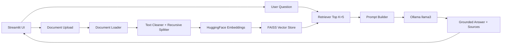

# Enterprise RAG Assistant

A production-oriented Retrieval-Augmented Generation assistant for enterprise documents. Users upload PDF, DOCX, or TXT files, build separate FAISS knowledge bases, and ask grounded questions through a Streamlit chat UI backed by Ollama Llama 3.

## Features

- Multi-file upload for PDF, DOCX, and TXT documents.
- Text cleaning and recursive chunking with chunk size `1000` and overlap `200`.
- HuggingFace embeddings with `sentence-transformers/all-MiniLM-L6-v2`.
- FAISS vector indexes saved locally under `vectorstore/<knowledge-base>/faiss_index`.
- Automatic index loading and rebuilds when new files are uploaded.
- Semantic retrieval with top `K=5`, similarity scores, confidence score, source document, page number, and retrieved chunk display.
- Multi-turn chat with session memory, sidebar history, clear chat, Markdown download, and PDF export.
- Multiple knowledge bases, source metadata filtering, dashboard metrics, retrieved chunk viewer, dark UI, logs, and error handling for common production issues.
- SQLite feedback capture with helpful/not helpful ratings.
- SQLite query analytics for questions asked, average retrieval time, and average response time.
- Automatic knowledge base summaries and suggested questions after indexing.

## Architecture



## Project Structure

```text
enterprise-rag-assistant/
├── app.py
├── requirements.txt
├── README.md
├── .env
├── data/
├── database/
├── logs/
│   └── app.log
├── vectorstore/
│   └── <kb_name>/
│       ├── faiss_index/
│       └── metadata.json
├── src/
│   ├── loaders/
│   │   ├── pdf_loader.py
│   │   ├── docx_loader.py
│   │   └── txt_loader.py
│   ├── processing/
│   │   ├── cleaner.py
│   │   └── chunker.py
│   ├── embeddings/
│   ├── vectorstore/
│   ├── retrieval/
│   ├── llm/
│   ├── database/
│   ├── ui/
│   ├── document_loader.py
│   ├── text_splitter.py
│   ├── embedding_manager.py
│   ├── vector_store.py
│   ├── retriever.py
│   ├── prompt_template.py
│   ├── rag_pipeline.py
│   ├── chat_memory.py
│   └── utils.py
└── assets/
```

## Installation

Use Python 3.11.

```bash
python -m venv .venv
.venv\Scripts\activate
pip install -r requirements.txt
```

## Ollama Setup

Install Ollama from [ollama.com](https://ollama.com), then pull Llama 3:

```bash
ollama pull llama3
ollama serve
```

The app reads these environment values from `.env`:

```env
OLLAMA_MODEL=llama3
OLLAMA_BASE_URL=http://localhost:11434
```

## Run The App

```bash
streamlit run app.py
```

Open the local URL Streamlit prints, usually `http://localhost:8501`.

## Usage

1. Select or type a knowledge base name in the sidebar.
2. Upload one or more PDF, DOCX, or TXT files.
3. Click **Build KB**.
4. Ask questions in the chat box.
5. Use suggested questions or type your own.
6. Expand **Sources and retrieved chunks** under each assistant response to inspect retrieved chunks and scores.
7. Rate answers with thumbs up/down. Feedback is stored in SQLite.

## Deployment Notes

- Keep `data/`, `vectorstore/`, and `logs/` on persistent storage.
- Ollama must be reachable from the Streamlit runtime.
- For Streamlit Community Cloud, use a hosted LLM endpoint instead of local Ollama, or deploy Ollama on reachable infrastructure and set `OLLAMA_BASE_URL`.
- For larger enterprise corpora, consider moving FAISS indexes to a durable shared volume and adding authentication around the Streamlit app.

## Logging

Application logs are written to:

```text
logs/app.log
```

Logged events include uploads, loading, indexing, retrieval, generation, and errors.

## SQLite

The app creates:

```text
database/enterprise_rag.db
```

Tables:

- `feedback`: question, answer, rating, timestamp.
- `query_metrics`: knowledge base, question, retrieval time, response time, confidence, timestamp.

## Sample Documents

The `data/sample/` folder includes starter TXT documents you can upload to test the pipeline.
